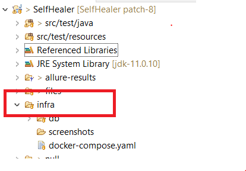

# SelfHealer
 
 
 
 
 


## Build with
[](https://search.maven.org/search?q=g:%22com.epam.healenium%22%20AND%20a:%22healenium-web%22)


## This Famework have

+ Auto healing capability to fix selenium based flaky test (implemented LCS for fininding locators ).  
<!-- + UI Performance timings for Web Application (without any third party tool using google navigation API).-->
<!-- + Control Test Parrallel run  from TestNg xml . -->
<!-- + API integration for beck end Test-->

## How To use

#### To enable Autohealing capability
1. You must have docker installed in your system  (refer [here](https://docs.docker.com/desktop/))  
2. Go to infra folder in Project folder  



3. Open cmd/terminal and run below command

```
docker-compose up -d
```  
4. Verify that hlm-backend:latest and postgres docker containers are up and running:  
```
docker ps
```
5. Now you are all set and remember after test completion just stop the all docker contaners by running the below command(only for local run).  
Not required if you are running test on a server
```
docker-compose stop
```  


