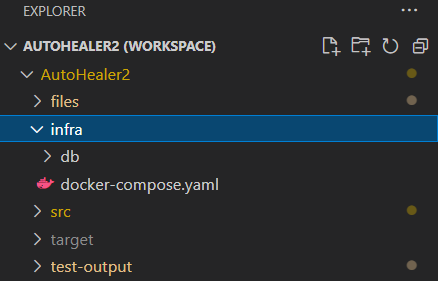

# AutoHealer2
 
 
 

## Build with

## This Famewaok have

+ Auto healing capability to fix selenium based flaky test (implemented LCS for fininding locators ).  
+ UI Performance timings for Web Application (without any third party tool using google navigation API).
+ Control Test Parrallel run  from TestNg xml . 

## How To use

#### To enable Autohealing capability
1.You must have docker installed in your system
2.Go to infra folder in Project folder

